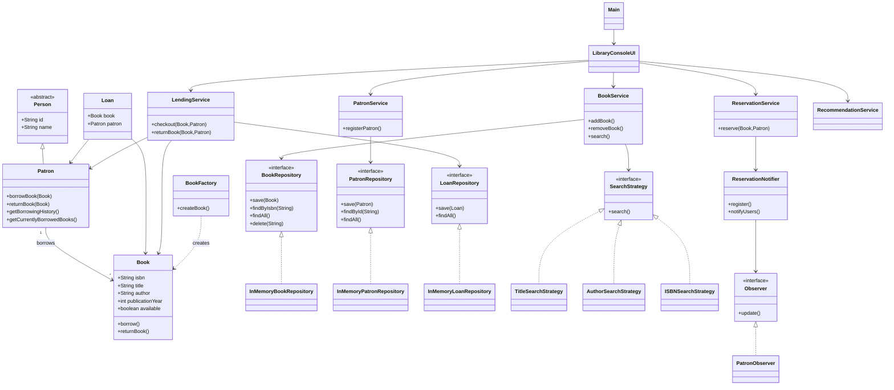

# Library Management System

A console-based Library Management System built in Java using Object-Oriented Programming principles and common software design patterns. The project demonstrates clean architecture through the use of repositories, services, interfaces, and design patterns such as Strategy, Observer, and Factory.

## Features

### Book Management

* Add new books to the library
* Remove books from the library
* Search books by:

  * Title
  * Author
  * ISBN
* View all available books

### Patron Management

* Register library patrons
* Maintain borrowing history
* Track currently borrowed books

### Lending System

* Borrow books
* Return books
* Prevent borrowing of unavailable books
* Track active loans

### Reservation System

* Reserve unavailable books
* Notify users when reserved books become available

### Recommendation System

* Generate book recommendations based on same authors from borrowing history. 

### Logging and Exception Handling

* Custom exception handling
* Logging of important library operations

---

## Technologies Used

* Java
* Object-Oriented Programming (OOP)
* Collections Framework
* Java Logging API

---

## Design Principles

This project follows several Object-Oriented Design principles:

### Encapsulation

Classes hide internal state and expose behavior through public methods.

### Abstraction

Interfaces are used to hide implementation details from clients.

### Inheritance

The `Patron` class extends the abstract `Person` class.

### Polymorphism

Search functionality is implemented using multiple search strategies through a common interface.

---

## Design Patterns Used

### Strategy Pattern

Allows searching books using different search algorithms without modifying existing code.

#### Components

* `SearchStrategy`
* `TitleSearchStrategy`
* `AuthorSearchStrategy`
* `ISBNSearchStrategy`

Example:

```java
SearchStrategy strategy = new TitleSearchStrategy();
bookService.search(strategy, "Harry Potter");
```

---

### Observer Pattern

Used to notify users when reserved books become available.

#### Components

* `Observer`
* `PatronObserver`
* `ReservationNotifier`

Flow:

1. User reserves a book.
2. User is registered as an observer.
3. When the book becomes available:

   * Notification is triggered.
   * Registered observers receive updates.

---

### Factory Pattern

Used to centralize object creation for books.

#### Component

* `BookFactory`

Example:

```java
Book book = BookFactory.createBook(
    "9780134685991",
    "Effective Java",
    "Joshua Bloch",
    2018
);
```

---

### Repository Pattern

Separates data access logic from business logic.

#### Components

* `BookRepository`
* `PatronRepository`
* `InMemoryBookRepository`
* `InMemoryPatronRepository`

Benefits:

* Better maintainability
* Easier testing
* Future database integration support

---

## Project Structure

```text
src
│
├── factory
│   └── BookFactory
│
├── model
│   ├── Book
│   ├── Loan
│   ├── Patron
│   └── Person
│
├── observer
│   ├── Observer
│   ├── PatronObserver
│   └── ReservationNotifier
│
├── repository
│   ├── BookRepository
│   ├── PatronRepository
│   ├── InMemoryBookRepository
│   └── InMemoryPatronRepository
│
├── service
│   ├── BookService
│   ├── PatronService
│   ├── LendingService
│   ├── ReservationService
│   ├── RecommendationService
│   └── BranchTransferService
│
├── strategy
│   ├── SearchStrategy
│   ├── TitleSearchStrategy
│   ├── AuthorSearchStrategy
│   └── ISBNSearchStrategy
│
├── util
│   └── LibraryLogger
│
└── Main.java
```

---

## Class Relationships

### Core Domain

```text
Person
   ▲
   │
Patron

Loan ───► Book
  │
  └────► Patron
```

### Search Strategy

```text
SearchStrategy
    ▲
    │
 ┌──┼──────────────┐
 │  │              │
Title Author     ISBN
Search Search   Search
```

### Observer Pattern

```text
ReservationNotifier
        │
        ▼
    Observer
        ▲
        │
PatronObserver
```

---

## Running the Application

### Prerequisites

* Java 26
* IntelliJ IDEA
### Run

```
java Main
```

---

## Sample Workflow

1. Register a patron.
2. Add books to the library.
3. Search books by title, author, or ISBN.
4. Borrow a book.
5. Return a book.
6. Reserve unavailable books.
7. Receive notifications when books become available.
8. View recommendations.

---

## Future Improvements

* Database integration (MySQL/PostgreSQL)
* Spring Boot migration
* REST APIs
* Authentication and authorization
* Fine calculation system
* Multi-branch library support
* Email and SMS notifications
* Unit and integration testing
* Dependency Injection using Spring

---

## Learning Objectives

This project was developed to practice:

* Java programming
* Object-Oriented Design
* SOLID Principles
* Design Patterns
* Layered Architecture
* Repository Pattern
* Exception Handling
* Collections Framework

---
# Library Management System
## System Design




## Author

Nalam Sai Amrit

Built as a learning project to strengthen understanding of Java, OOP, Design Patterns, and Software Design Principles.
